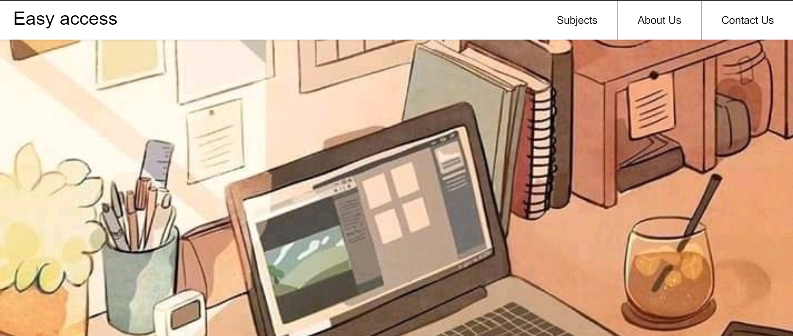
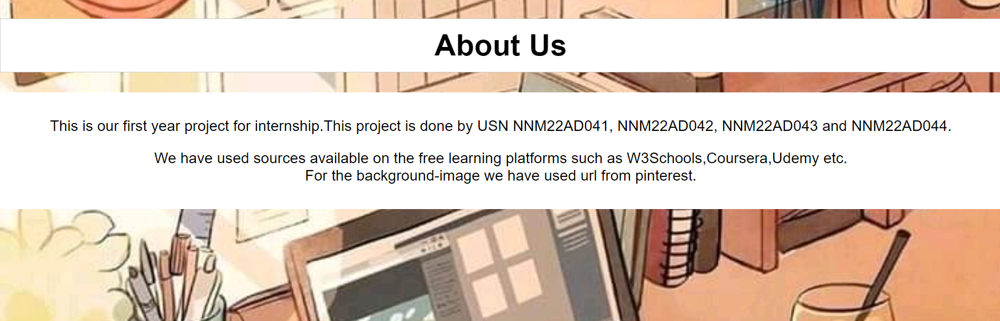
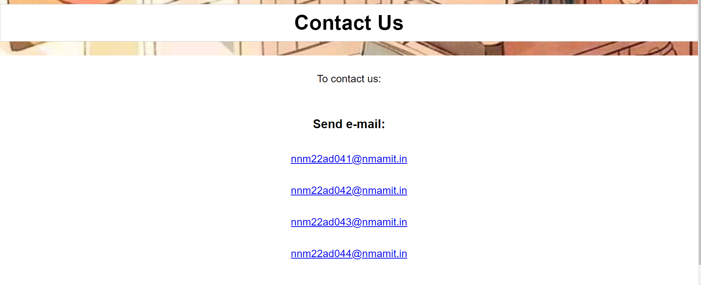

# Easy Access

This is a simple website project titled "Easy Access" for the first-year internship project. It includes pages for subjects, about us, and contact us.

## Pages

1. **Subjects**: This page contains links to various subjects.
   - [Maths](maths.html)
   - [Physics](physics.html)
   - [Chemistry](chemistry.html)
   - [Civil](civil.html)
   - [Mechanical](mechanics.html)
   - [Basic Electronics](be.html)
   - [Basic Electrical](bee.html)
   - [CPP](cpp.html)
   - [Logic Design](ld.html)
   - [COI](coi.html)
   - [Technical English](english.html)
   - [Biology](biology.html)
   - [Python](python.html)
   - [EVS](evs.html)

2. **About Us**: This page provides information about the project and contributors.
   - [About Us](about.html)

3. **Contact Us**: This page provides contact information.
   - [Contact Us](contact.html)

## Contributors
- [R Ajay Prabhu](https://github.com/RAJAY04)
- Raksha P
- [Rashmi N](https://github.com/nrashmi06)
- Rhea D'Mello

## Screenshots

### Home Page

### Subjects Page

### About Page

### Contact Page

## Contact

For any inquiries, please reach out to the contributors via GitHub profiles.
